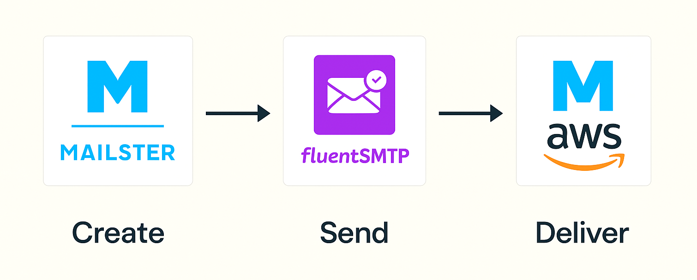

# WordPress Newsletter System with Mailster, FluentSMTP, and Amazon SES

This project documents how I set up a cost-effective, high-deliverability newsletter system using:

- ✅ [Mailster](https://mailster.co) for newsletter creation and subscriber management
- ✅ [FluentSMTP](https://fluentsmtp.com) for email delivery integration
- ✅ [Amazon SES](https://aws.amazon.com/ses/) for reliable bulk email sending

The solution enables me to send bi-monthly campaigns to ~9,000 opted-in subscribers directly from my WordPress website.

---

## Workflow

This outlines how the components interact during the email sending process:

1. **Mailster** – user interface for campaign creation and list management
2. **FluentSMTP** – delivery bridge that routes outgoing emails
3. **Amazon SES** – final sender that delivers the emails to recipients

> **Mailster → FluentSMTP → Amazon SES**

---

## Startup Costs & Options

- **Mailster License**: $199 one-time (via CodeCanyon)
  - Used for managing subscribers, list segmentation, unsubscribe links, and profile update options
  - Optional — you can use SES + FluentSMTP without Mailster if you handle subscribers another way
- **FluentSMTP**: Free
- **Amazon SES**: ~$0.10 per 1,000 emails

---

## Tech Stack

- WordPress (self-hosted via SiteGround)
- Mailster (Premium plugin)
- FluentSMTP (Free plugin)
- Amazon Simple Email Service (SES)
- Google Workspace (for inbox email)
- DNS and hosting managed via SiteGround

---

## Step-by-Step Setup

### 1. Domain, Email & DNS Configuration

- **Domain**: `mambocity.co.uk`
- **Registrar & DNS**: SiteGround
- **Email hosting**: Google Workspace
- **SES domain verification**: Done
- **DNS records added on SiteGround**:
  - ✅ SPF: `v=spf1 include:_spf.google.com include:amazonses.com ~all`
  - ✅ DKIM: 3x CNAME records from SES
  - ✅ DMARC: `v=DMARC1; p=none; aspf=r; adkim=r;`
  - ✅ MX (MAIL FROM): `mail.mambocity.co.uk`
- Preserved Google MX records for regular inbox use

### 2. FluentSMTP Configuration

- Region: `eu-west-2 (London)`
- IAM user created with `AmazonSESFullAccess`
- Access Key and Secret Key stored securely
- Domain and MAIL FROM verified
- Production access granted (50,000 emails/day, 14/sec)
- Test email successfully sent and passed SPF/DKIM checks

### 3. WordPress Plugin Setup

#### FluentSMTP
- Installed plugin and configured connection to Amazon SES via IAM credentials
- Ensures WordPress `wp_mail()` sends through SES

#### Mailster
- Installed premium plugin via CodeCanyon
- Uploaded ~9,000 subscribers (via CSV)
- Created mailing lists and opt-in forms
- Enabled profile updates and mailing list selection by users

### 4. Integration: Mailster + FluentSMTP

- In Mailster: selected **SMTP** but left all fields blank
- FluentSMTP intercepts and routes Mailster emails via SES
- No additional SES plugin for Mailster required

### 5. Testing and Sending

- Created and sent internal test campaign via Mailster
- Confirmed delivery, formatting, unsubscribe links, tracking
- Scaled up to full list send after successful tests

---

## Analytics & Deliverability

- Mailster tracks opens, clicks, unsubscribes
- FluentSMTP logs email delivery
- Amazon SES console shows bounce/complaint metrics

---

## Challenges

- MAIL FROM domain MX config delayed deliverability — fixed by keeping only required MX for SES alongside Google
- SES production access required a use-case email and took 3 days
- IAM permissions and DNS setup needed careful configuration

---

## Best Practices

- Use FluentSMTP for all outgoing WordPress emails
- Include unsubscribe links in every campaign (for compliance)
- Use SPF, DKIM, and DMARC for domain reputation
- Regularly clean your email list based on engagement

---

## Resources

- [Mailster Plugin](https://codecanyon.net/item/mailster-email-newsletter-plugin-for-wordpress/3078294)
- [Amazon SES Docs](https://docs.aws.amazon.com/ses/latest/dg/)
- [FluentSMTP Docs](https://fluentsmtp.com/docs/)
- [SiteGround DNS Management](https://www.siteground.com/kb/how_to_manage_dns_records/)

---

## License
MIT License

---

## Author
Robert White — [mambocity.co.uk](https://mambocity.co.uk)

---

Feel free to fork or adapt this setup for your own WordPress + SES newsletter needs!
